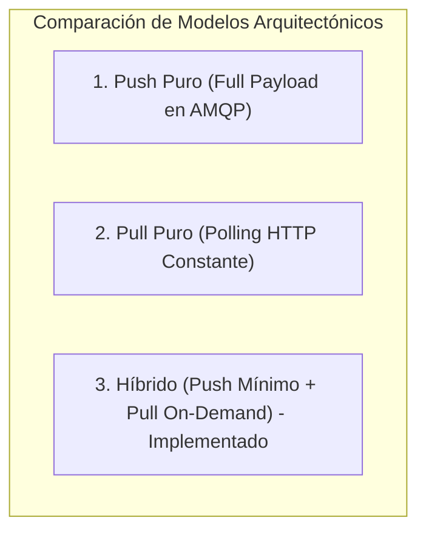

# Discusión de Arquitectura: Trade-offs y Estimación Back-of-the-Envelope

**Curso:** INF-326 - Arquitectura de Software  
**Tarea 1:** Patrón Publish-Subscribe con Modelo Pull Adaptado  
**Dominio:** Sistema de Notificación y Consulta de Eventos Sísmicos  

---

## 1. Discusión de Trade-offs Arquitectónicos (20%)

El sistema propuesto implementa un patrón híbrido: **Publish-Subscribe basado en eventos mínimos** a través de un broker AMQP (CloudAMQP/RabbitMQ) combinado con un **modelo Pull bajo demanda** a través de una API REST (FastAPI) para la obtención de información detallada.

A continuación, se analizan los principales *trade-offs* de diseño arquitectónico y su relevancia en el dominio sísmico:

### 1.1. Push Puro vs. Modelo Híbrido (Push Mínimo + Pull On-Demand)

* **Push Puro (Event-Carried State Transfer):**
  * *Mecanismo:* El publicador envía en cada mensaje AMQP la ficha completa del sismo (magnitud, profundidad, referencias, estaciones que registraron, tiempos UTC y local).
  * *Ventajas:* Los suscriptores no requieren realizar ninguna petición adicional a un servicio centralizado; se elimina el *round-trip* HTTP y se desacopla completamente al suscriptor del servicio web.
  * *Desventajas:* Desperdicio de ancho de banda y memoria en el broker. En un país como Chile con geografía alargada (~4,300 km), un sismo en Arica es descartado por estaciones en Concepción o Punta Arenas. Enviar toda la información técnica a través del broker hacia nodos que inmediatamente la desecharán genera sobrecarga innecesaria (*data bloat*).
* **Modelo Híbrido Implementado (Claim-Check Pattern / Notification-Driven Pull):**
  * *Mecanismo:* El broker distribuye únicamente una **notificación mínima y liviana** (`id`, `latitud`, `longitud`). El suscriptor evalúa su cercanía geográfica (< 500 km) y, solo si existe interés, ejecuta un `GET /sismos/{id}`.
  * *Trade-off:* Se introduce un acoplamiento temporal/espacial hacia la API HTTP y latencia adicional para los suscriptores interesados, pero se optimiza drásticamente el tráfico del broker y el uso de red en los suscriptores no interesados (que representan habitualmente la mayoría).
  * *Consideración en el dominio:* **Es un trade-off muy favorable.** Los sismos son eventos localizados; raramente un sismo afectará a todo el territorio nacional simultáneamente. Mantener el canal de broadcast lo más liviano posible asegura que la notificación inicial llegue con mínima latencia de red.

---

### 1.2. Filtrado en el Cliente (Fanout) vs. Filtrado en el Broker (Topic / Direct Routing)

* **Filtrado en el Cliente (Arquitectura Actual - Fanout Exchange):**
  * *Mecanismo:* El broker transmite el evento a todos los suscriptores mediante un exchange `fanout`. Cada nodo suscriptor calcula la distancia geodésica mediante la fórmula de Haversine y decide si filtrar o procesar.
  * *Trade-off:* Simplicidad máxima en el broker y autonomía en los clientes. Cada suscriptor define sus propias reglas de negocio (ej. su ubicación exacta y su radio de interés, que podría variar dinámicamente).
  * *Consideración:* En RabbitMQ, el enrutamiento nativo no soporta cálculos trigonométricos continuos (distancia radial euclidiana o geodésica). Mapear zonas geográficas a *routing keys* discretas (ej. `sismos.norte`, `sismos.centro`, `sismos.sur`) introduciría imprecisiones en los bordes fronterizos entre zonas. Por ende, calcular la distancia en el cliente es la solución más precisa y flexible.

---

### 1.3. Disponibilidad y Tolerancia a Fallos

* **Punto Único de Falla (SPOF):**
  * En la arquitectura híbrida, si el servicio HTTP de FastAPI deja de estar disponible, los suscriptores aún reciben la alerta inicial de ocurrencia de sismo (alta disponibilidad en la detección gracias a RabbitMQ), pero experimentarán una degradación graciosa (*graceful degradation*) al no poder cargar la ficha completa temporalmente.
* **Mecanismos de Mitigación en Producción:**
  * Implementar políticas de reintento con *exponential backoff* y *circuit breaker* en los suscriptores.
  * Integrar almacenamiento en caché (ej. Redis o CDN) frente a la API HTTP para absorber ráfagas masivas de consultas ante sismos de gran escala.

---

## 2. Discusión de Estimación "Back of the Envelope" (10%)

El método de **Back-of-the-Envelope** (estimación en servilleta) permite dimensionar el sistema, proyectar el consumo de recursos de red/cómputo y justificar numéricamente la arquitectura propuesta.

A continuación, se detalla **cómo sería posible realizar este cálculo** utilizando los datos propios del fenómeno sismológico:

---

### 2.1. Variables y Parámetros del Fenómeno Sísmico

Para modelar la carga del sistema, se deben recopilar las siguientes variables empíricas:

1. **Tasa de Ocurrencia Sísmica ($R_{sismos}$):**
   * Según datos del Centro Sismológico Nacional (CSN), en Chile se registran en promedio entre **15 y 25 sismos diarios** perceptibles/instrumentales ($\approx 0.0002$ a $0.0003\text{ sismos/segundo}$).
   * En caso de un evento de alta magnitud (terremoto $M_w > 7.0$), la tasa de réplicas puede alcanzar picos de **300 a 500 sismos en las primeras 24 horas** ($\approx 0.0035\text{ a }0.006\text{ QPS}$ de publicaciones).
2. **Distribución Espacial y Probabilidad de Interés ($P_{interes}$):**
   * Longitud de Chile: $\approx 4,300\text{ km}$.
   * Diámetro de cobertura por nodo ($2 \times 500\text{ km} = 1,000\text{ km}$).
   * Fracción territorial cubierta por un nodo $\approx \frac{1000}{4300} \approx 23.2\%$.
   * Para $N = 5$ estaciones distribuidas linealmente (Arica, Coquimbo, Valparaíso, Concepción, Punta Arenas), un sismo típico activa a lo más a **1 o 2 estaciones** ($P_{interes} \approx 20\% - 40\%$).
3. **Tamaño de los Mensajes:**
   * $S_{min}$ (Payload evento AMQP mínimo): $\approx 60\text{ bytes}$ (ID + latitud + longitud en JSON).
   * $S_{full}$ (Payload respuesta HTTP completa): $\approx 350\text{ bytes}$ (fechas UTC/local, profundidad, magnitud, escalas, referencia geográfica en JSON).
   * $S_{req}$ (Encabezados de petición HTTP `GET`): $\approx 150\text{ bytes}$.

---

### 2.2. Modelo de Cálculo de Ancho de Banda y Tráfico de Red

Para $N$ suscriptores conectados y $E$ sismos notificados:

#### A. Tráfico en Enfoque Push Puro (Mensaje Completo en Broker):
$$\text{Tráfico}_{\text{Push}} = E \times N \times S_{full}$$

#### B. Tráfico en Enfoque Híbrido (Propuesto):
$$\text{Tráfico}_{\text{Híbrido}} = \underbrace{E \times N \times S_{min}}_{\text{Broker AMQP}} + \underbrace{E \times (N \times P_{interes}) \times (S_{req} + S_{full})}_{\text{Servicio HTTP Pull}}$$

#### Análisis Comparativo:
* Si $P_{interes} \le 0.3$ (solo 1 o 2 de las 5 estaciones se encuentran a $<500\text{ km}$):
  * **Tráfico en Broker AMQP:** Se reduce en un $\approx 83\%$ respecto a transmitir la ficha completa en cada mensaje ($60\text{ B}$ vs $350\text{ B}$).
  * **Tráfico Total del Sistema:** Se evita la transmisión redundante de fichas detalladas hacia el $70\%$ de los nodos que no las requieren.
  * **Escalabilidad con $N$ grande:** Si el sistema escala a $N = 10,000$ usuarios móviles o estaciones IoT en todo el país, el ahorro es masivo: el broker sólo distribuye paquetes ultralivianos de $60\text{ bytes}$, y la API HTTP solo atiende a la fracción cercana al epicentro.

---

### 2.3. Estimación de Capacidad de Procesamiento y Concurrencia (QPS)

* **Throughput del Publicador:**
  * Menor a 1 mensaje por segundo incluso durante enjambres sísmicos.
  * CloudAMQP / RabbitMQ procesa decenas de miles de mensajes por segundo sin problemas de saturación.
* **Throughput del Servicio HTTP (FastAPI):**
  * Para $N=5$ suscriptores: Con $P_{interes} \approx 0.3$, cada sismo genera entre **1 y 2 peticiones HTTP concurrentes**, lo cual representa una carga despreciable para FastAPI (que soporta miles de peticiones por segundo en modo asíncrono).
  * Si el sistema creciera a nivel nacional con miles de clientes, el cálculo *Back-of-the-Envelope* indicaría la necesidad de implementar una capa de almacenamiento en caché en memoria (FastAPI in-memory cache / Redis) con TTL de algunos segundos para servir solicitudes concurrentes idénticas sin impactar la base de datos.
